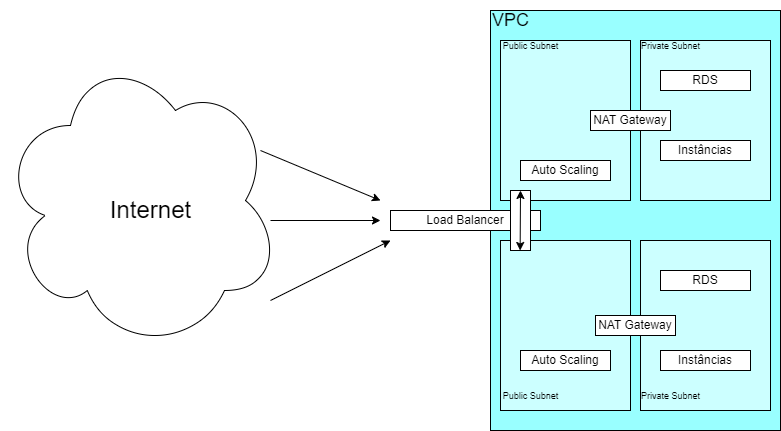

# Implementação de Arquitetura Cloud na AWS com Terraform

## Descrição do Projeto
Provisiona uma arquitetura na AWS utilizando o Terraform. Cria-se um banco de dados RDS definido em user_data.tftpl que faz o uso de um Application Load Balancer (ALB) e instâncias EC2 com Auto Scaling para garantir a alta disponibilidade da aplicação.

## Sumário
- [Descrição do Projeto](#descrição-do-projeto)
- [Sumário](#sumário)
- [Instruções de uso](#instruções-de-uso)
  - [Criando a infraestrutura](#criando-a-infraestrutura)
  - [Destruindo a infraestrutura](#destruindo-a-infraestrutura)
- [Estudo de custos](#estudo-de-custos)
- [Sobre os componentes](#sobre-os-componentes)

## Instruções de uso
### Criando a infraestrutura
Após clonar o repositório e entrar nele, é necessário criar um par de chaves SSH para oacesso às instâncias EC2. Para isso, execute o comando abaixo, que criará um par de chaves no diretório imediatamente anterior ao do repositório clonado:
```bash
ssh-keygen -t rsa -b 2048 -f ../nome-da-chave
``` 
Também é necessário criar um arquivo de variáveis para a sua base de dados. Para isso, crie um arquivo chamado `secrets.tfvars` no diretório anterior ao do repositório e preencha-o com as seguintes variáveis:
```bash
db_name     = "nome-do-banco-de-dados"
db_username = "nome-do-usuario-master"
db_password = "senha-do-usuario-master"
my_ip       = "ip-da-sua-maquina"
```
Caso as credencias forem criadas em endereços relativos diferentes, será necessário alterar o caminho para o arquivo ec2.tf e os comandos abaixo.
Para executar o projeto, execute os seguintes comandos e responda `yes` quando solicitado:
```bash
terraform init
terraform plan -var-file=../secrets.tfvars
terraform apply -var-file=../secrets.tfvars
```
### Destruindo a infraestrutura
Para destruir a infraestrutura criada, execute o seguinte comando e responda `yes` quando solicitado:
```bash
terraform destroy -var-file=../secrets.tfvars
```
## Estudo de custos
[Estimativa de custos](Estimativa-de-Custos.pdf)  
Os custos apresentados no arquivo acima foram estimados com base em um uso moderado da aplicação.  
Para otimizar os custos, uma alternativa seria diminuir o número de portas NAT utilizadas pelo VPC, uma vez que esse elemento representa aproximadamenete 50% do custo total estimado. Além disso, o RDS poderia ter sua capacidade reduzida para o estritamente necessário, visto que este também representa uma parcela significativa do custo total estimado.

## Esquema da arquitetura


## Sobre os componentes
### VPC
Uma nuvem privada virtual (VPC) é uma rede virtual que é criada e isolada dentro de uma nuvem pública. Ela fornece uma maneira para se criar e gerenciar sua própria rede na nuvem.

### Subnets
Uma sub-rede, ou subnet, é uma subdivisão lógica de uma rede IP. A subdivisão de uma rede grande em redes menores resulta num tráfego de rede reduzido, administração simplificada e melhor performance de rede.

### Auto Scaling
Auto Scaling é um serviço que permite que você aumente ou diminua automaticamente a capacidade de seus recursos, neste caso instâncias, de acordo com a demanda. Ele ajuda a garantir que você tenha o número correto de instâncias EC2 disponíveis para lidar com a carga de seu aplicativo.

### Application Load Balancer
Um Application Load Balancer (ALB) é um serviço de balanceamento de carga que distribui o tráfego de entrada de aplicativos para várias instâncias, garantindo que nenhuma máquina fique sobrecarregada.

### RDS
O Amazon Relational Database Service (RDS) é um serviço gerenciado de banco de dados que fornece uma maneira fácil de configurar, operar e escalar bancos de dados relacionais na nuvem.
